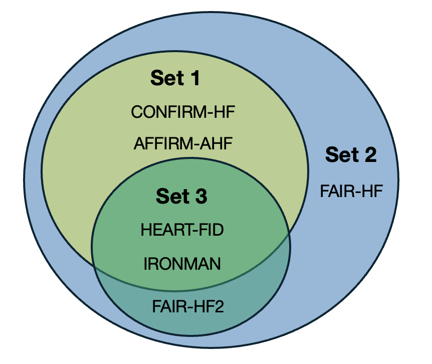

# Efficacy of intravenous iron for the treatment of heart failure varies by method of meta-analysis – a Bayesian and frequentist reappraisal of the evidence

Code to reproduce analyses of RCTs of iron supplementation in patients with heart failure and iron deficiency. 

Iron deficiency is common in heart failure and contributes to fatigue and worse outcomes. Iron replacement with intravenous iron may therefore reduce hospitalisations and cardiovascular death. Although initial randomised trials were encouraging, recent, larger trials have been less conclusive. We therefore reappraised the evidence by incorporating prior information and the sensitivity of these conclusions to different analytical methods.

[Protocol](https://www.crd.york.ac.uk/PROSPERO/view/CRD420251052977)

[Paper (link tbc)](#nothing)

## Code structure

### 0_dataprep 
Includes extracted results from the included studies and arranges these in data frames for various outcomes. Includes code to plot original frequentist results. 

### 1_analysis 
The main analysis is performed in `bayesian_map_iron.R`, `bayesian_map_iron_fairhf2.R`, and `bayesian_map_iron_set3.R` for the different combinations of trials:

Other files are avialble for: 
* Summarising the choice of heterogeneity prior ($\tau_\sigma$)
* Estimating the absolute differences between IV iron and control, including Poisson modelling of control event rates
* Estimating the size of a hypothetical future trial based on estimates of (i) control rates, and (ii) treatment effect

### 2_plotting
`bayesian_summaries.R` produces plots of the posterior probabilities of various treatment effects of clinical importance. Also plots estimates from the various Bayesian and frequentist methods employed.

## License
...
